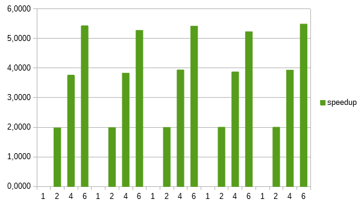

Nome: Miguel Mazuim da Silva / Disciplina: Programação Paralela

Parte I: Pthreads

1)Particionamento: É representado por esta parte do código:
" typedef struct 
 {
   double *a;
   double *b;
   double c; 
   int wsize;
   int repeat; 
 } dotdata_t;", onde é definido toda estrutura de como vai ser separado os dados.
 
 Comunicação:Toda comunicação entre as threads é definida na função dotprod_threads, onde é feito o controle delas, desde da sua criação até a união de todas e deletar.
 
 Aglomeração:É representado por este código:
 "  pthread_mutex_lock (&mutexsum);
   dotdata.c += mysum;
   pthread_mutex_unlock (&mutexsum);
"  e

" for (i = 0; i < nthreads; i++) {
      pthread_join(threads[i], NULL);
   }
", Serve principalmente para impedir a condição de corrida e unir os resultados.

 Mapeamento: É feito em dois trechos do código, toda a função dotprod_worker, onde é realizado os calculos e este trecho:
 "for (i = 0; i < nthreads; i++) {
      pthread_create(&threads[i], &attr, dotprod_worker, (void *) i);
   }
", onde é criado e destribuido as threads.

2)A aceleração foi grande, quase duplicando o desempenho e reduzindo o tempo pela metade.

3 e 4) 
Tem uma grande aceleração por adicionar mais threads, mas pelo que testei, é eficiente somente para casos que não sejam grandes.
| tool     | nthreads  | size    | repetitions  | usec     | speedup |
|----------|-----------|---------|--------------|----------|---------|
| Pthreads | 1         | 1000000 | 2000         | 5621072  | 0,0000  |
| Pthreads | 2         | 500000  | 2000         | 2805236  | 2,0038  |
| Pthreads | 4         | 250000  | 2000         | 1442014  | 3,8981  |
| Pthreads | 6         | 166667  | 2000         | 1026312  | 5,4770  |
| Pthreads | 8         | 125000  | 2000         | 820605   | 6,8499  |
| Pthreads | 10        | 100000  | 2000         | 655545   | 8,5747  |
| Pthreads | 12        | 83334   | 2000         | 556527   | 10,1003 |
| Pthreads | 1         | 6000000 | 2000         | 33625857 | 0,0000  |
| Pthreads | 2         | 3000000 | 2000         | 16819819 | 1,9992  |
| Pthreads | 4         | 1500000 | 2000         | 8894915  | 3,7803  |
| Pthreads | 6         | 1000000 | 2000         | 6348025  | 5,2971  |
| Pthreads | 8         | 750000  | 2000         | 6150193  | 5,4674  |
| Pthreads | 10        | 600000  | 2000         | 6669775  | 5,0415  |
| Pthreads | 12        | 500000  | 2000         | 6841765  | 4,9148  |
| Pthreads | 1         | 600000  | 1000         | 1685475  | 0,0000  |
| Pthreads | 2         | 300000  | 1000         | 847040   | 1,9898  |
| Pthreads | 4         | 150000  | 1000         | 424550   | 3,9700  |
| Pthreads | 6         | 100000  | 1000         | 319259   | 5,2793  |
| Pthreads | 8         | 75000   | 1000         | 243311   | 6,9272  |
| Pthreads | 10        | 60000   | 1000         | 196471   | 8,5787  |
| Pthreads | 12        | 50000   | 1000         | 170768   | 9,8700  |
| Pthreads | 1         | 6000000 | 4000         | 67186257 | 0,0000  |
| Pthreads | 2         | 3000000 | 4000         | 33750454 | 1,9907  |
| Pthreads | 4         | 1500000 | 4000         | 18162057 | 3,6993  |
| Pthreads | 6         | 1000000 | 4000         | 13070405 | 5,1403  |
| Pthreads | 8         | 750000  | 4000         | 12652516 | 5,3101  |
| Pthreads | 10        | 600000  | 4000         | 13756192 | 4,8841  |
| Pthreads | 12        | 500000  | 4000         | 13902264 | 4,8328  |
| Pthreads | 1         | 6000    | 1000000      | 16585585 | 0,0000  |
| Pthreads | 2         | 3000    | 1000000      | 8338887  | 1,9889  |
| Pthreads | 4         | 1500    | 1000000      | 4249461  | 3,9030  |
| Pthreads | 6         | 1000    | 1000000      | 3082387  | 5,3808  |
| Pthreads | 8         | 750     | 1000000      | 2417845  | 6,8597  |
| Pthreads | 10        | 600     | 1000000      | 1997293  | 8,3040  |
| Pthreads | 12        | 500     | 1000000      | 1869694  | 8,8707  |

E o grafico de speedup:

 

5)A diferença principal entre os programas são essas linhas "pthread_mutex_lock (&mutexsum);" e "pthread_mutex_unlock (&mutexsum);". Elas fazem o controle da sincronia das threads, evitando o caso de condição de corrida, onde duas thread podem pegar o valor e sobreescrever o resultado da outra. Se for retirado essas linhas, a condição de corrida vai acontecer.

Parte 2: OpenMP

1)

2)
